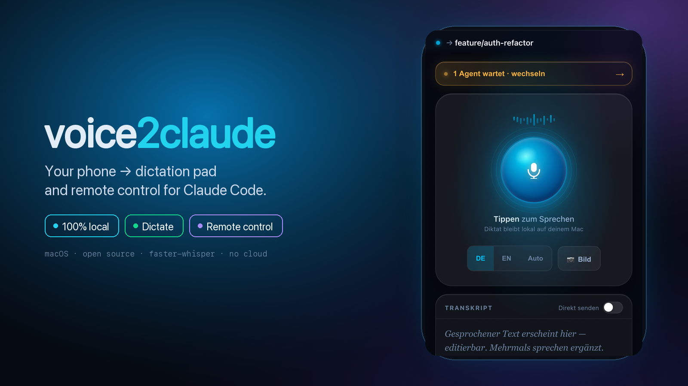

<a id="top"></a>
<div align="center">



<p>
  
  
  
  
  <a href="https://github.com/SchoenTom/voice2claude/stargazers"></a>
</p>

<p>
  <a href="#-quick-start">Quick start</a> &nbsp;·&nbsp;
  <a href="#-features">Features</a> &nbsp;·&nbsp;
  <a href="#-how-it-works">How it works</a> &nbsp;·&nbsp;
  <a href="#deutsch">🇩🇪 Deutsch</a>
</p>

</div>

> **What is this?** Push to talk on your phone → your words are transcribed **on your Mac** (faster‑whisper, never the cloud) → dropped straight into your running [`claude`](https://claude.com/claude-code) session. A live **control tower** shows which agent is waiting on you; one tap accepts its suggestion, stops it, or switches sessions across Spaces — all from the couch. **100% local. No accounts, no API keys, no cloud.**

---

## ✦ Why it's different

| | |
|---|---|
| 🔒 **Local & private** | Audio is transcribed on your Mac and **never leaves it**. No accounts, no cloud, no keys. |
| 🗣 **Dictate** | Hold to talk → on‑device transcription → straight into the prompt. DE / EN / Auto. |
| 🎛 **Remote‑control** | The whole keyboard from your pocket — confirm, stop, navigate, accept suggestions, switch agents. |

## ⚡ Features

| | |
|---|---|
| 🏰 **Control tower** | Per‑session status — **working / ready / active**. See at a glance which agent is waiting on you; the waiting ones rise to the top. |
| ⇥↵ **One‑tap accept** | A single tap sends **Tab → Enter** to accept *and* submit Claude's pre‑filled suggestion. |
| 🔀 **Session switch** | Every Claude window — even across Spaces — as a tappable list; tap to switch. |
| 🎬 **Reel / Video → Text** | Paste an Instagram / YouTube / TikTok URL → transcribed locally (warm model, no reload) → into the transcript. |
| 🗣 **Live dictation** | Speak → words appear **live** in a field that grows with your text; **pause / resume** to think, read back what was understood, fix, then send. Fully local. DE / EN / Auto. |
| 🎛 **Remote control** | Enter · Esc · ⌃C · arrows · digits · Tab + app / window navigation from your phone. |
| 🖼 **Images** | Send a photo, screenshot **or clipboard image** (📋 paste) → appears inline in Claude's prompt. |
| ▶️ **One‑click start** | A menu‑bar app (🎙️) — no terminal command needed. |
| 🛡 **Safety guard** | Types only into terminals; otherwise it just lands on the clipboard. |

---

## 🚀 Quick start

> Requires **macOS** + phone on the **same Wi‑Fi**. First run downloads the Whisper model (`small` ≈ 460 MB).

1. **Double‑click `install.command`** — sets everything up **and builds `voice2claude.app`**.
2. **Drag `voice2claude.app` into your Dock**, then right‑click → **Open** once (Gatekeeper, first time only).
3. Click the **🎙️ menu‑bar icon → "📱 Open on iPhone (QR)"** → scan with your phone's camera → the interface opens. **Talk, tap, control.**

> **Tip:** 🎙️ → "Start at login" and you never touch a terminal again. Prefer the terminal? `./run.sh`.
> Without the one Accessibility permission it still works — text lands on the clipboard, you press ⌘V.

---

## 🔧 How it works

```
  ┌─ Phone ─────────────┐        ┌─ Mac (voice2claude.app) ───────────────────────┐
  │ 🎙️ talk              │ audio  │  Flask server                                   │
  │ ⌨️ remote control     │ ─────► │   ├─ faster-whisper   (local, no cloud)         │
  │ (browser / Shortcut) │  HTTP  │   │     └─► text                                 │
  └─────────┬────────────┘        │   ├─ safety guard     (terminals only)          │
            │                     │   └─► osascript / tmux ─► focused terminal      │
            │  QR / .local name   │                              │                  │
            └─────────────────────┤                              ▼                  │
                  (no IP typing)   │                      ┌─ claude (CLI) ─┐         │
                                   └──────────────────────│  your prompt   │─────────┘
                                                          └────────────────┘
```

Audio is transcribed **locally** and never leaves your Mac. The connection uses the stable Bonjour name `<your-mac>.local` — **no more typing IP addresses**, even when the network changes.

### Remote‑control keys

| Key | What it does |
|---|---|
| ↵ / ⎋ / ↑ ↓ | confirm / cancel / navigate menus |
| 1 2 3 / y / n | pick options, yes / no |
| ⇥ · ⇥↵ | Tab · **accept suggestion** (Tab → Enter) |
| ⌃C | stop the running agent |
| ⇧⇥ | toggle Claude Code mode |
| App ← → · ⌘T | jump between apps / terminal tabs |

`/key` understands arbitrary combos — `cmd`, `shift`, `ctrl`, `opt` + any key. One button = any shortcut.

---

<a id="deutsch"></a>
<details>
<summary><b>🇩🇪 Anleitung (Deutsch)</b></summary>

<br>

**Dein Phone als Diktiergerät _und Fernbedienung_ für [Claude Code](https://claude.com/claude-code).** Sprich ins Handy → der Text wird **lokal** transkribiert (faster‑whisper, kein Cloud‑Upload) → landet im Prompt deiner laufenden `claude`‑Session. Plus ein Fernbedienungs‑Panel: bestätigen, stoppen, weiterschicken, **Bilder einfügen** und auf einen Blick sehen, **welcher Agent gerade auf dich wartet**.

### So funktioniert es grundlegend

Es gibt **ein Bau‑Werkzeug** und **eine App** — verwechsle sie nicht:

| | was es ist | wie oft |
|---|---|---|
| `install.command` | **Werkzeug** — richtet alles ein **und baut die App** | **1×** |
| **`voice2claude.app`** | **die echte App** (Icon 🎙️) — das, was du benutzt | täglich |

### Einrichten (einmalig, ~2 Min)

1. **`install.command` doppelklicken.** Richtet alles ein, baut **`voice2claude.app`** und öffnet den Finder.
2. **`voice2claude.app` ins Dock ziehen.**
3. Per **Rechtsklick → „Öffnen"** einmal starten (Gatekeeper, nur beim 1. Mal).
4. Falls 🎙️ „⚠️ Bedienungshilfen aktivieren" zeigt → klicken → **`voice2claude`** einschalten.

### Täglich benutzen

1. **Dock‑Icon 🎙️ klicken** → Server startet automatisch im Hintergrund.
2. **🎙️‑Menü → „📱 Auf iPhone öffnen (QR)"** → großer QR am Mac.
3. **iPhone‑Kamera drauf** (gleiches WLAN) → Oberfläche öffnet sich. Reden / tippen.

> **Tipp:** 🎙️ → „Bei Anmeldung starten" → immer da. Terminal‑Start ginge auch: `./run.sh`.

### Die eine Einrichtung, die zählt: Bedienungshilfen

Damit der Text sich **selbst tippt**, braucht macOS einmalig die Erlaubnis, Tastendrücke zu senden:
**Systemeinstellungen → Datenschutz & Sicherheit → Bedienungshilfen** → den Eintrag auf **AN** stellen
(`voice2claude` bei App‑Start, dein **Terminal** bei `./run.sh`). Am einfachsten: im 🎙️‑Menü **„⚠️ Bedienungshilfen aktivieren"**. **Ohne** Freigabe geht alles trotzdem — der Text landet in der Zwischenablage, du drückst `⌘V`.

### Die zwei Handy‑Clients

- **A — iOS‑Kurzbefehl** (Diktat, HTTP, kein Zertifikat): „Audio aufnehmen" → „Inhalte von URL abrufen" (POST `http://<MAC-IP>:8765/transcribe`, Formular, Datei‑Feld `audio`). Auf „Auf‑Rückseite‑tippen" legen.
- **B — Browser** (Diktat **+ Fernbedienung**, HTTPS): `https://<MAC-IP>:8766/` öffnen, Zertifikatswarnung einmalig akzeptieren. Volles UI: Push‑to‑talk, Kontrollturm, Fernsteuerung, Status‑Zeile. Server lauscht parallel auf **HTTP 8765** + **HTTPS 8766**.

</details>

<details>
<summary><b>⚙️ Konfiguration & Dateien</b></summary>

<br>

`.env` (siehe `.env.example`):

| Variable | Default | Bedeutung |
|---|---|---|
| `V2C_MODEL` | `small` | `tiny`…`large-v3` — größer = genauer, langsamer |
| `V2C_INJECT` | `auto` | `auto` / `paste` / `tmux` / `clipboard` |
| `V2C_TMUX` | `claude` | tmux‑Ziel |
| `V2C_LANG` | `de` | Sprache erzwingen; leer = Auto‑Erkennung |
| `V2C_PORT` | `8765` | Port (Browser‑HTTPS auf Port+1) |
| `V2C_GUARD` | `1` | nur in Terminals tippen, sonst Clipboard |
| `V2C_COOKIES` | aus | `safari`/`chrome`/… — Browser‑Cookies für login‑gesperrte Reels (`/transcribe-url`) |
| `V2C_TOKEN` | aus | Zugriffsschutz; nötig in fremden WLANs |

Dateien:

| Datei | Rolle |
|---|---|
| `server.py` | Flask: `/transcribe` `/transcribe-url` `/type` `/key` `/status` `/health` |
| `inject.py` | Injection‑Backends + Fernbedienung + Frontmost/Accessibility |
| `menubar.py` | Menüleisten‑App (🎙️ Start‑Button) |
| `static/index.html` | Handy‑UI: Push‑to‑talk, Kontrollturm, Fernsteuerung, Status |

</details>

---

<div align="center">

**MIT** · made for [Claude Code](https://claude.com/claude-code) · built with [faster‑whisper](https://github.com/SYSTRAN/faster-whisper) + Flask · audio stays on your Mac 🔒

<sub><a href="#top">↑ back to top</a></sub>

</div>
