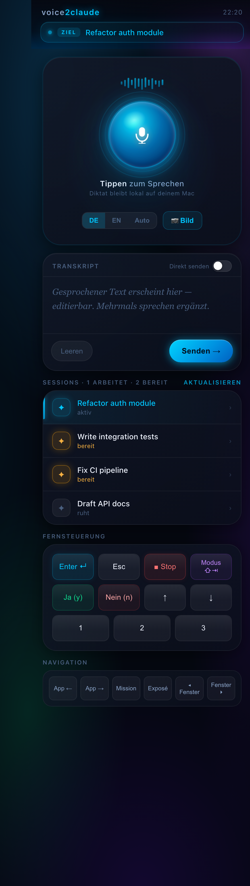

# voice2claude

> 🇬🇧 *Turn your iPhone into a local voice‑dictation device **and remote control** for [Claude Code](https://claude.com/claude-code). Speak, edit, send, switch between parallel agent sessions and approve — from your pocket. 100% local (faster‑whisper), macOS, no cloud, no accounts. (README in German below.)*

**Dein iPhone als Diktiergerät _und Fernbedienung_ für [Claude Code](https://claude.com/claude-code).**
Sprich ins Handy → der Text wird **lokal** transkribiert (faster-whisper, kein
Cloud-Upload) → landet im Prompt deiner laufenden `claude`-Session. Plus ein
Fernbedienungs-Panel: Claude vom Sofa aus bestätigen, stoppen, weiterschicken,
**Bilder einfügen** und auf einen Blick sehen, **welcher Agent gerade auf dich wartet**.

<p align="center">
  
</p>

### Pipeline

```
  ┌─ iPhone ────────────┐        ┌─ Mac (voice2claude.app) ───────────────────────┐
  │ 🎙️ sprechen          │ audio  │  Flask-Server                                   │
  │ ⌨️ Fernbedienung      │ ─────► │   ├─ faster-whisper  (lokal, kein Cloud)        │
  │ (Browser / Shortcut) │  HTTP  │   │     └─► Text                                 │
  └─────────┬────────────┘        │   ├─ Safety-Guard  (nur Terminals)              │
            │                     │   └─► osascript / tmux ─► fokussiertes Terminal │
            │   QR / .local-Name  │                              │                  │
            └─────────────────────┤                              ▼                  │
                  (kein IP-Tippen) │                      ┌─ claude (CLI) ─┐         │
                                   └──────────────────────│  dein Prompt   │─────────┘
                                                          └────────────────┘
```

Audio wird **lokal** transkribiert und verlässt deinen Mac nie. Die Verbindung
läuft über den stabilen Bonjour-Namen `<dein-mac>.local` — **keine IP-Adresse
mehr eintippen**, auch wenn sich das Netz ändert.

- 🔒 **Lokal & privat** — Audio verlässt deinen Mac nie. Keine Accounts, keine Cloud.
- 🗣 **Diktat** — sprechen → lokal transkribiert (faster-whisper) → in den Prompt. **DE / EN / Auto** umschaltbar.
- 🏰 **Kontrollturm** — pro Session ein Status (**arbeitet / bereit / aktiv**) — sieh sofort, welcher Agent auf dich wartet.
- 🔀 **Session-Wechsel** — alle Claude-Fenster (auch über Spaces) als Liste, antippen wechselt.
- 🎛 **Fernbedienung** — Enter / Esc / ⌃C / Pfeile / Ziffern + App-/Fenster-Navigation vom Handy.
- 🖼 **Bilder** — Foto/Screenshot vom Handy → erscheint inline in Claudes Prompt.
- ▶️ **Start-Button** — Menüleisten-App (🎙️), kein Terminal-Befehl nötig.
- 🛡 **Safety-Guard** — tippt nur in Terminals; sonst nur Zwischenablage.

---

## So funktioniert es grundlegend (wichtig!)

Es gibt **ein Bau-Werkzeug** und **eine App**. Verwechsel sie nicht:

| | was es ist | wie oft |
|---|---|---|
| `install.command` | **Werkzeug** — richtet alles ein **und baut die App** | **1×** |
| **`voice2claude.app`** | **die echte App** (Icon 🎙️) — das, was du benutzt | täglich |

Du lässt das Werkzeug **einmal** laufen; danach klickst du nur noch die App.

## Einrichten (einmalig, ~2 Min)

1. **`install.command` doppelklicken.** Richtet alles ein, baut **`voice2claude.app`**
   und öffnet den Finder, der sie zeigt.
2. **`voice2claude.app` ins Dock ziehen** (genau wie jede andere App).
3. Per **Rechtsklick → „Öffnen"** einmal starten (Gatekeeper, nur beim 1. Mal).
4. Falls 🎙️ „⚠️ Bedienungshilfen aktivieren" zeigt → klicken → **`voice2claude`** einschalten.

## Täglich benutzen

1. **Dock-Icon 🎙️ klicken** → Server startet automatisch im Hintergrund (kein Terminal).
2. Im **🎙️-Menü → „📱 Auf iPhone öffnen (QR)"** → großer QR am Mac.
3. **iPhone-Kamera drauf** (gleiches WLAN/Hotspot) → Oberfläche öffnet sich. Reden/tippen.

> **Tipp:** 🎙️ → „Bei Anmeldung starten" → die App ist ab Login immer da, du
> klickst nie wieder irgendwas. Reiner Terminal-Start ginge auch: `./run.sh`.
> Erster Lauf lädt das Whisper-Modell (`small` ≈ 460 MB).

---

## Die eine Einrichtung, die zählt: Bedienungshilfen

Damit der Text sich **selbst tippt**, braucht macOS einmalig die Erlaubnis,
Tastendrücke zu senden:

**Systemeinstellungen → Datenschutz & Sicherheit → Bedienungshilfen** → den
Eintrag auf **AN** stellen:
- Startest du über **`voice2claude.app`** → schalte **`voice2claude`** ein.
- Startest du über **`./run.sh`** im Terminal → schalte dein **Terminal** ein.

Am einfachsten: im 🎙️-Menü **„⚠️ Bedienungshilfen aktivieren"** klicken — das
öffnet die richtige Seite und erklärt den Schalter. `./doctor.sh` prüft es auch.

- Steht der Eintrag nicht in der Liste? `+` unten → den App-Pfad wählen → AN.
- **Ohne** Freigabe geht trotzdem alles — der Text landet in der Zwischenablage,
  du drückst `⌘V` (Modus `clipboard`). Nichts ist blockiert, nur ein Tap mehr.

---

## Die zwei Handy-Clients

**A — iOS-Kurzbefehl (Diktat, kein Zertifikat nötig, läuft über HTTP):**
Kurzbefehle-App → „Audio aufnehmen" → „Inhalte von URL abrufen" (POST,
`http://<MAC-IP>:8765/transcribe`, Anfragetext **Formular**, Feld Typ **Datei**,
Schlüssel `audio` = Aufgenommenes Audio). Auf „Auf-Rückseite-tippen" legen.

**B — Browser (Diktat **+ Fernbedienung**, HTTPS):** `https://<MAC-IP>:8766/` öffnen,
Zertifikatswarnung einmalig akzeptieren. Hier hast du das volle UI: Push-to-talk,
Review-Modus, das **Fernbedienungs-Panel** und die **Status-Zeile** („→ welches
Fenster bekommt den Text"). Der Server lauscht parallel: **HTTP 8765** (Shortcut)
und **HTTPS 8766** (Browser).

---

## Fernbedienung

Das Browser-UI hat ein Tasten-Panel, das via `/key` und `/type` Tastendrücke an
Claude schickt — ideal, wenn ein Agent läuft und du nicht am Schreibtisch sitzt:

| Taste | Wofür |
|---|---|
| ↵ / ⎋ / ↑ ↓ ← | Bestätigen / Abbrechen / in Menüs navigieren |
| 1 2 3 / y / n | Optionen wählen, ja/nein |
| ⌃C | laufenden Agenten stoppen |
| ⇧⇥ | Claude-Code-Modus umschalten |
| Tab ← / → / ⌘T / ⌘1 | zwischen Terminal-Tabs springen, neuen Tab |
| Schnell-Prompts | „weiter", „commit und push", „erklär das" … (ein Tap) |

**Volle Tastatur:** `/key` versteht beliebige Kombos — `cmd`, `shift`, `ctrl`,
`opt` + jede Taste. Beispiele: `cmd+shift+]` (nächster Tab), `cmd+t` (neuer Tab),
`cmd+1` (Tab 1), `ctrl+c` (stop), `opt+left`. Ein Button = ein beliebiger
Shortcut — leg dir eigene an, indem du im UI `data-key="…"` setzt.

> Tippt immer ins **fokussierte** Terminal. Welches das ist, zeigt die Status-Zeile.
> Im `tmux`-Modus gehen Tasten ans benannte Ziel (Cmd/Opt-Kombos sind dort nicht
> sinnvoll — die laufen über den `paste`/frontmost-Weg).

---

## Konfiguration (`.env`, siehe `.env.example`)

| Variable | Default | Bedeutung |
|---|---|---|
| `V2C_MODEL` | `small` | `tiny`…`large-v3` — größer = genauer, langsamer |
| `V2C_INJECT` | `auto` | `auto`/`paste`/`tmux`/`clipboard` |
| `V2C_TMUX` | `claude` | tmux-Ziel |
| `V2C_APP` | fokussiert | paste: dieses Fenster vorher aktivieren |
| `V2C_LANG` | `de` | Sprache erzwingen; leer = Auto-Erkennung |
| `V2C_PORT` | `8765` | Port (Browser-HTTPS auf Port+1) |
| `V2C_GUARD` | `1` | nur in Terminals tippen, sonst Clipboard |
| `V2C_SOUND` | `0` | Bestätigungston nach dem Einfügen |
| `V2C_TOKEN` | aus | Zugriffsschutz; nötig in fremden WLANs (Fernbedienung!) |
| `V2C_PROMPT` | dev-Jargon | bias’t die Erkennung Richtung deiner Begriffe |

---

## Dateien

| Datei | Zweck |
|---|---|
| `server.py` | Flask: `/transcribe` `/type` `/key` `/status` `/health` |
| `inject.py` | Injection-Backends + Fernbedienung + Frontmost/Accessibility-Helfer |
| `menubar.py` | 🎙️ Menüleisten-App (Auto-Start, QR, Status, Login-Item) |
| `make_app.sh` | baut `voice2claude.app` (Doppelklick-Start-Button) |
| `static/index.html` | Handy-UI: Push-to-talk, Review, Fernbedienung, Status |
| `run.sh` / `voice2claude.command` | Server / Menüleiste im Terminal starten |
| `install.command` / `setup.sh` | einmalige Einrichtung |
| `doctor.sh` | Selbsttest: Deps, Bedienungshilfen, Ports, Netz |

Diktat-Verlauf wird nach `~/.voice2claude/history.log` geschrieben.

## Lizenz

MIT — siehe [LICENSE](LICENSE).
